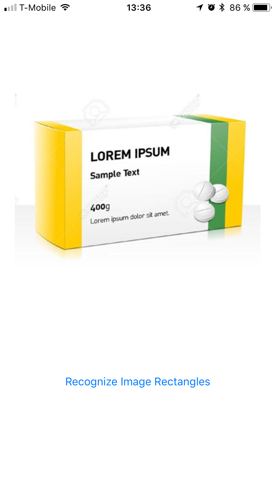

# iOS 11+ Vision in Titanium
Use the native iOS 11+ "Vision" framework in Axway Titanium.

| Original image | Processed image |
|----------------|-------------------|
|  |  |

## Requirements
- [x] Titanium SDK 6.2.0 or later

## API's

### Methods

#### `detectTextRectangles(args)`
- `image` (String | Ti.Blob - _Required_)
- `callback` (Function - _Required_)
- `reportCharacterBoxes` (Boolean - _Optional_)

#### `detectFaceRectangles(args)`
- `image` (String | Ti.Blob - _Required_)
- `callback` (Function - _Required_)

## Example
```js
var Vision = require('ti.vision');

var win = Ti.UI.createWindow({
    backgroundColor: '#fff'
});

var btn = Ti.UI.createButton({
    title: 'Recognize Image Rectangles'
});

btn.addEventListener('click', function() {
    if (!Vision.isSupported()) {
        return Ti.API.error('Sorry dude, iOS 11+ only!');
    }
    
    Vision.detectTextRectangles({
        image: 'image_sample_tr.png',
        callback: function(e) {
            if (!e.success) {
                return Ti.API.error(e.error);
            }
            
            Ti.API.info(e);
        }
    });
});

win.add(btn);
win.open();
```

## Build
```js
cd iphone
appc ti build -p ios --build-only
```

## Legal

This module is Copyright (c) 2017-Present by Appcelerator, Inc. All Rights Reserved. 
Usage of this module is subject to the Terms of Service agreement with Appcelerator, Inc.  
